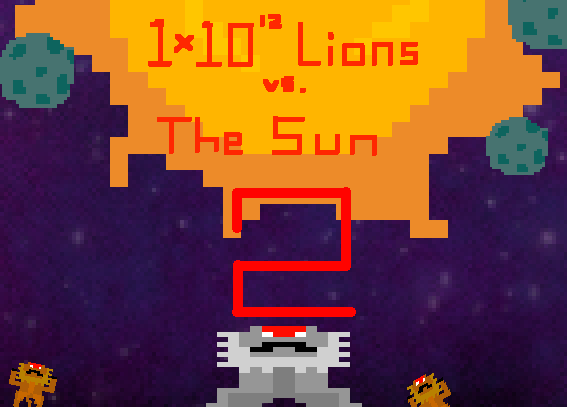

# One Trillion Lions vs The Sun 2
A 3D Asteroids clone with a twist

## The Game

One Trillion Lions vs The Sun 2 (OTLS2) is a sequel to a game created to solve a tough question: "Who would win: one trillion liions or the sun?" Would the lions win if they could collapse into a black hole? What if they were organized into a space fighting force? The answer is that they would most likely lose, but they would fight with honor. In this game, you take control of the SS Lion, a fighter sent to destroy the forces of the sun by your pride's alpha, Gompapi. It is a fight to the death, for the sun is too powerful.

This was a 2-week long mini-project, and all voxels and textures were done in house. Licenses for music and sounds can be found in the Licenses.txt file.

## Features

* Two different celestial bodies to destroy
* 3D flight
* Voxel models
* A giant sun to help orientation
* Lion-themed cursor and crosshair
* A charge-up laser
